<a id="readme-top"></a>

<!-- ABOUT THE PROJECT -->
## About The Project
This project is an application developed in Unity that voxelizes a mesh and then renders it. The applicaton has multiple modes for rendering and voxelization.

<div align="center">
    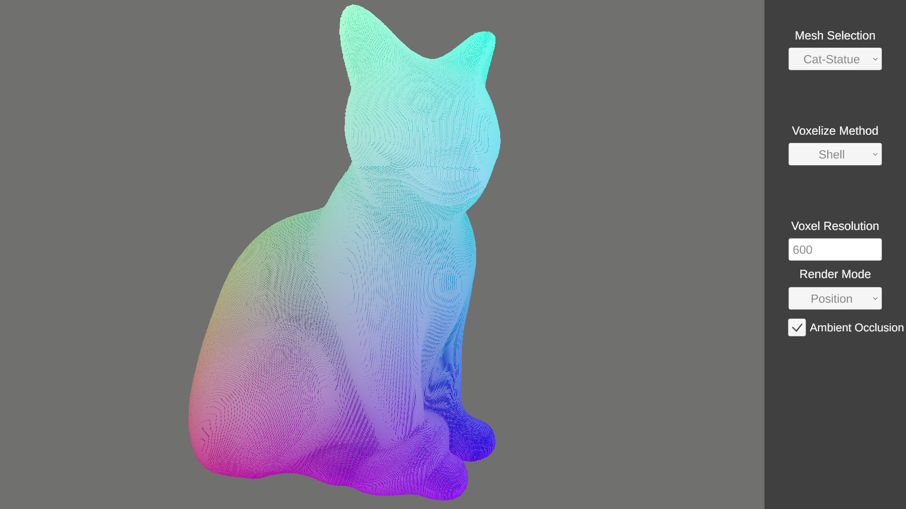
</div>

## Built With
The project was created using the Unity Engine 3D.

* Engine
  ```
  Unity 2022.3.58f1 URP
  ```

<!-- GETTING STARTED -->
## Getting Started
If you want to work on the project yourself you need to do the following:

1. Install the Unity engine with the correct verion on your machine. 

2. Clone this repository.
   
3. In Unity Hub add a project and locate your cloned repository.  

4. Open the project and then open the Sample Scene in the Assets/Scenes folder

<!-- USAGE EXAMPLES -->
# Usage
## Features
### Models 
The application has 5 models included: 

1. Cat-Statue

2. Horse-Statue

3. Ruber-Duck

4. Plant

5. Teapod

### Voxelize Methods
1. Shell: 
   
    This method loops over each triangle in the mesh and marks each voxel that the triangle intersects in any way as solid. The inside of a model is empty but the voxelizesation seems a bit more accurate and faster for higher resoluiton. 

2. Volume: 
   
    This method loops over each possible voxel and checks if the voxel is inside a mesh. 

### Voxel Resolution
You can select a custom resolution for voxelizesation between 1 and 2048. 

With the voxelize method Shell i got performance issues with a resolution of 1000. With volume the performance started to tank at around 180. For testing i used a RTX 3070 and a Ryzen 7 5800X.

<div align="center">
    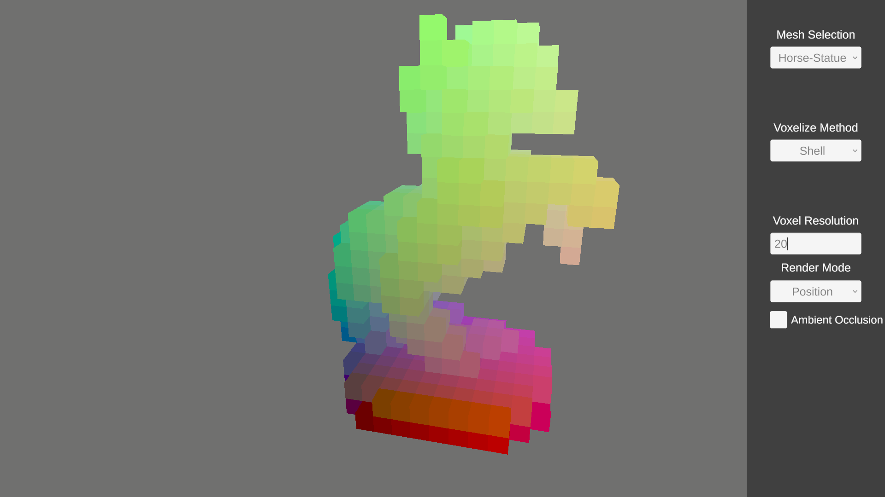
</div>
Resolution 20
<br/>

<div align="center">
    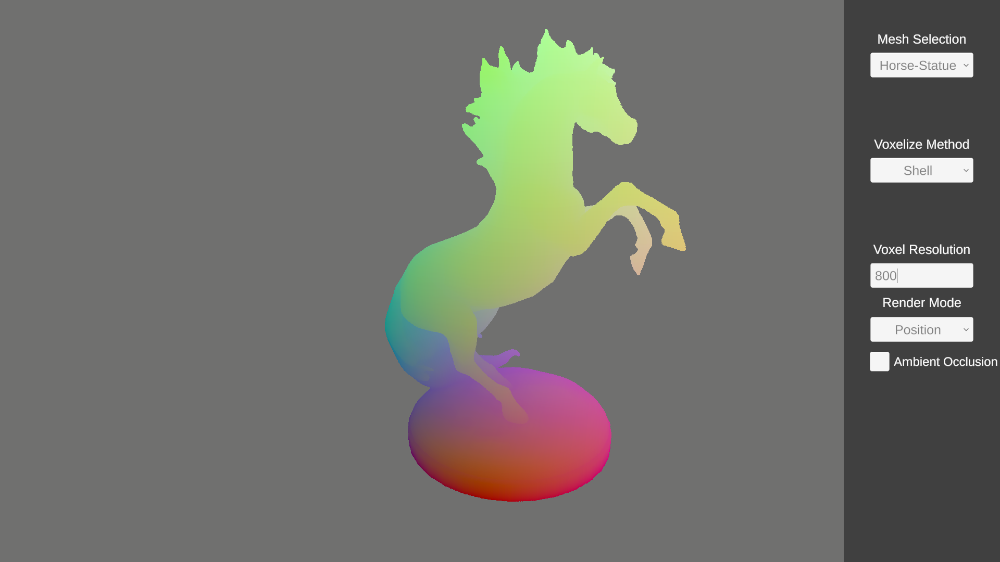
</div>
Resolution 800

### Render Modes
There are following 7 render modes:

1. Solid: Renders a solid white if ray hits a voxel.
<div align="center">
    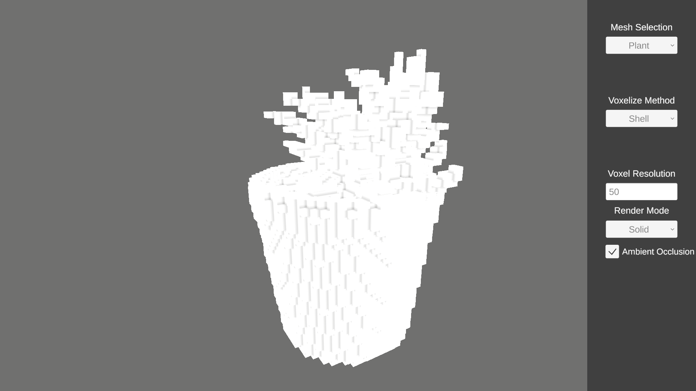
</div>

2. Position: Renders a color based on the position of the voxel in the global bounds.
<div align="center">
    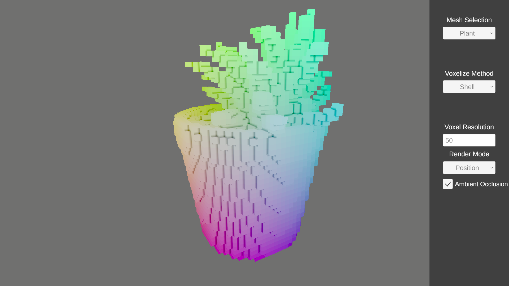
</div>

3. Depth: Renders a brighter color if voxel is close to camera.
<div align="center">
    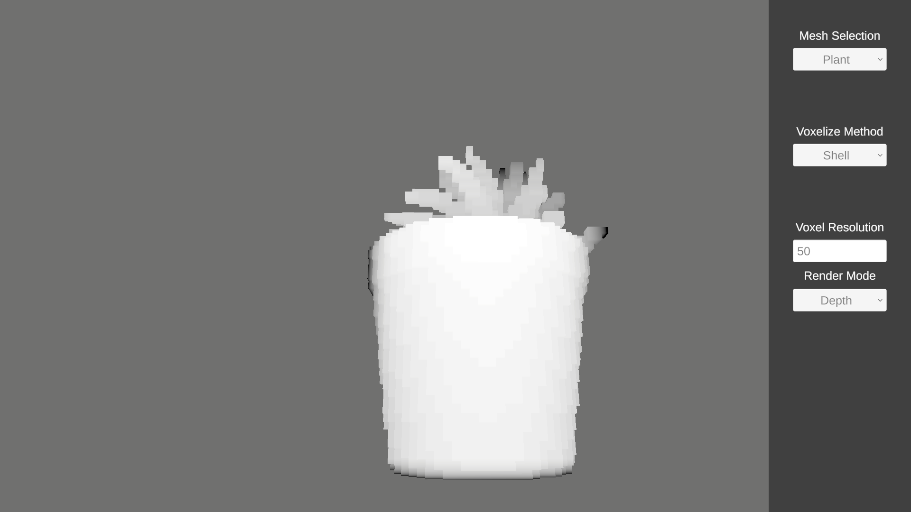
</div>

4. Face: Renders a color based on face orientation of the voxel where the ray hits.
<div align="center">
    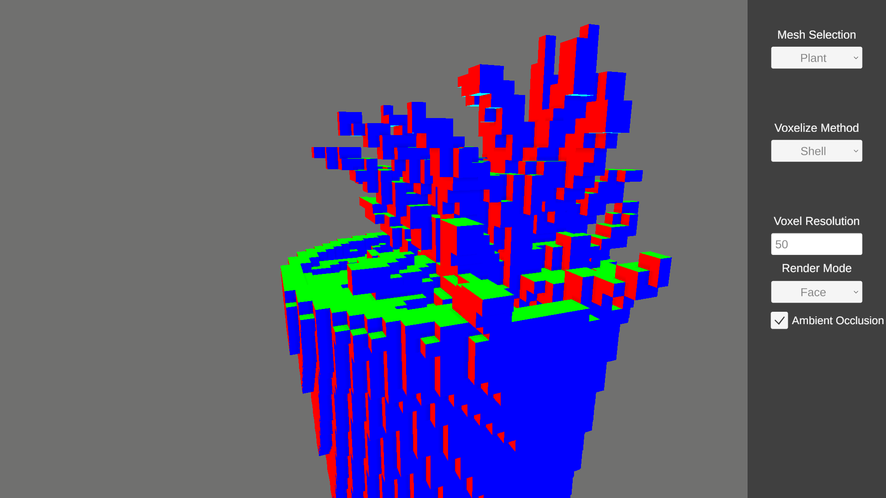
</div>

5. UV: Renders the uv coordinate of the hit point on the voxel
<div align="center">
    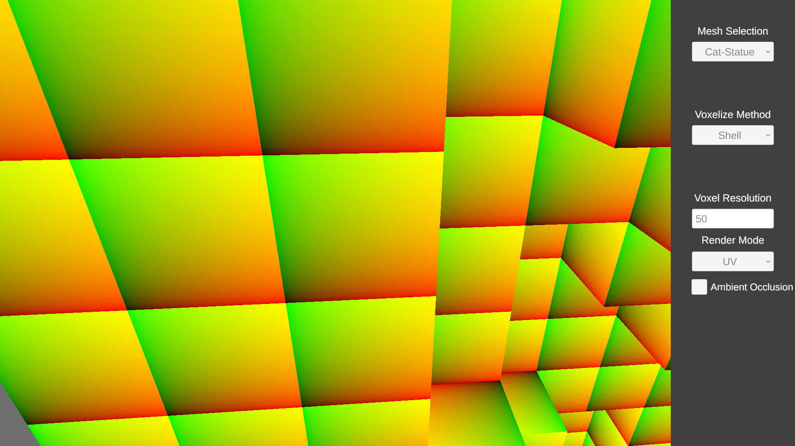
</div>

6. Texture: Renders the texture sampled from the uv.
<div align="center">
    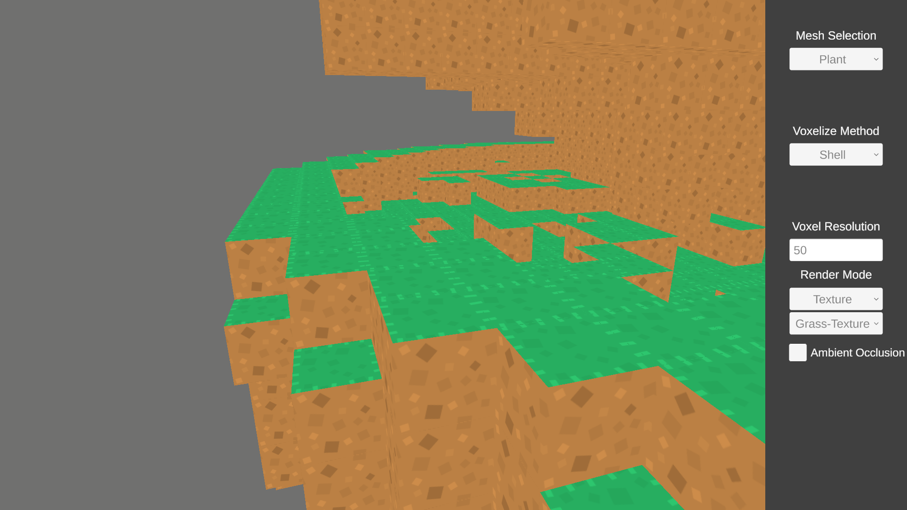
</div>

7. Local Position: Renders the local position of the hitpoint in relation to the voxel it hit.
<div align="center">
    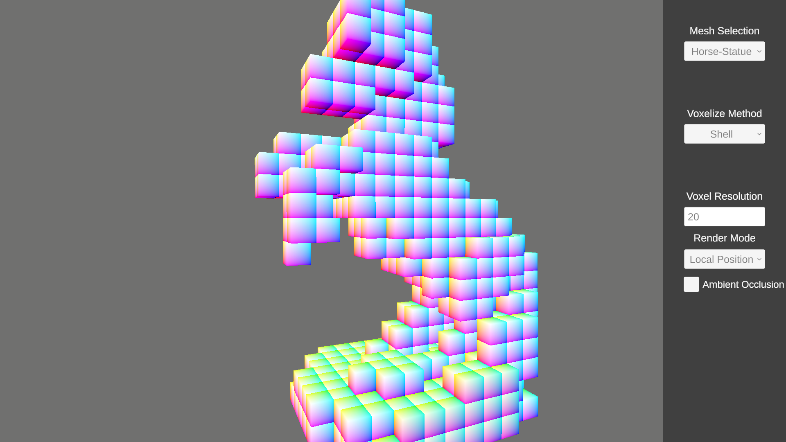
</div>

### Textures
This application has two texture included. 

1. A test texture to check if faces and uv are correctly calculated.

2. A simple gras block texture.

### Ambient Occlusion
In all render modes except Depth you can enable ambient occlusion. 

Ambient Occlusion enabled:
<div align="center">
    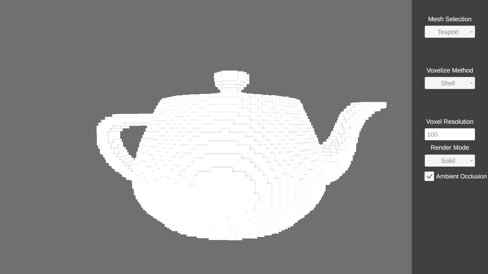
</div>

Ambient Occlusion disabled:
<div align="center">
    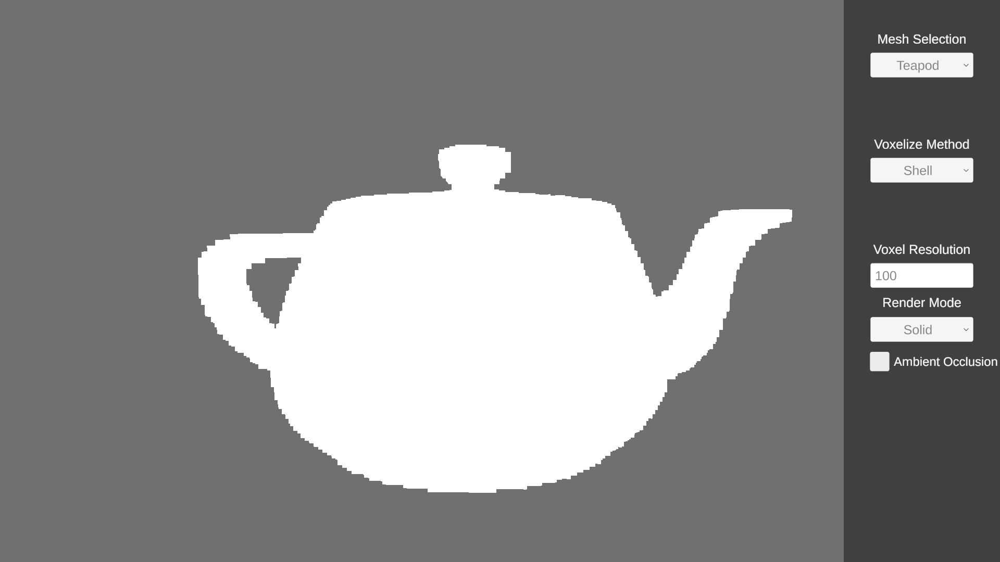
</div>


<!-- LICENSE -->
# License

Distributed under the MIT License. See `LICENCE.txt`</a> for more information.

<p align="right">(<a href="#readme-top">back to top</a>)</p>
